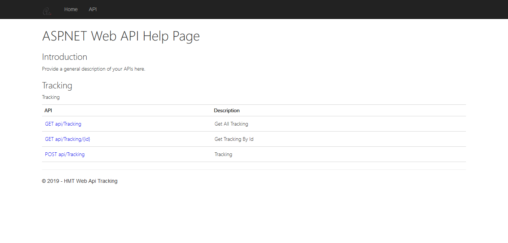
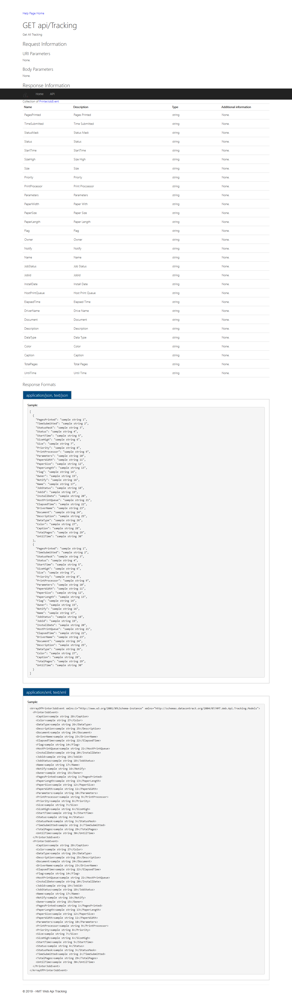

# 

## HMT.Web.Api.Tracking - Hardware Management Tool Tracking

A management tool that provides easy access to hardware interfaces to automate management tasks on local or remote computers.

IT managers and System Specialists; provides fast and practical solutions for monitoring, reporting and auditing critical operations.

Basically, the application interface toolkit that targets windows devices plans to support other operating systems such as linux and macos in the future.

## Hardware Management Tool Web Application Api Tracking Site

## Hardware Management Tool Web Application Api Tracking Api

## Hardware Management Tool Web Application Api Tracking Document
